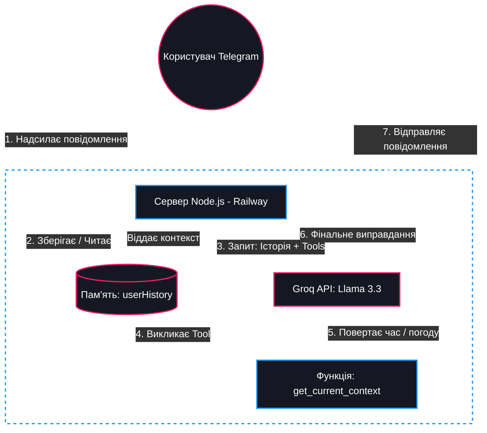

# 🍜 Генератор Локшини *([Noodle Generator](https://t.me/noodleGeneratorBot))*

Це персональний ШІ-адвокат у справах провалених дедлайнів, прогуляних пар та незручних повідомлень. Це інтелектуальний Telegram-бот, який не просто генерує текст, а веде осмислений діалог, адаптуючись до контексту та вибраного стилю спілкування. Також тут є дуже цікавий режим "Олександр Іванов", в якому ви зможете поспілкуватися з віртуальним куратором групи ІПЗс-25-1.

---

## 🎯 Цільова аудиторія
- **Студенти:** яким потрібно креативне виправдання для викладачів або кураторів.
- **Працівники:** для делікатної відповіді колегам чи босу у разі факапів.
- **Будь-хто:** хто опинився у незручній комунікаційній ситуації та потребує поради (режим "Радник").
- **Усі,** хто хоче поговорити з Олександром Олександровичем Івановим без нього самого.

---

## 🛠 Технічна реалізація та ШІ-паттерни

Проєкт реалізований на базі **Node.js** з використанням бібліотеки **Telegraf** та **Groq SDK** (модель `llama-3.3-70b-versatile`).

### Ключові особливості:
1. **Function Calling (Виклик функцій):** Бот реалізує просунутий паттерн взаємодії з LLM. Перед генерацією фінальної відповіді модель звертається до інструменту `get_current_context`, щоб отримати актуальний час, день тижня та погодні умови. Це дозволяє створювати виправдання, що базуються на реальних фактах (наприклад, посилання на затори у робочий час або погану погоду).

2. **Memory & Context (Пам'ять):**
   Реалізовано систему збереження історії діалогу (`userHistory`). Бот не просто відповідає на останню репліку, а пам'ятає контекст попередніх повідомлень, що дозволяє вести повноцінну розмову та уточнювати деталі ситуації.

3. **Multi-Role System:**
   Підтримка 8 різних режимів (агентів), кожен з яких має унікальний системний промпт та специфічну поведінку (від офіційного вчителя до саркастичного куратора).

4. **Захист від Prompt Injection:**
   У системний промпт інтегровано фільтри, які запобігають спробам користувача зламати роль бота або використовувати його для виконання сторонніх завдань.

---

## 🚀 Покрокова інструкція із запуску

### 1. Попередні вимоги
- Встановлений **Node.js** (v18 або вище).
- Отриманий `BOT_TOKEN` від [@BotFather](https://t.me/botfather).
- Отриманий `GROQ_API_KEYS` від [Groq Cloud](https://console.groq.com/).

### 2. Встановлення
```bash
git clone https://github.com/katerynksh/noodleGenerator.git
cd noodleGenerator
npm install
```

### 3. Налаштування
Створіть файл `.env` у кореневій папці та додайте ключі:
```bash
BOT_TOKEN=ваш_токен_телеграм
GROQ_API_KEYS=ключ_1,ключ_2,ключ_3...
```

### 4. Запуск
```bash
npm start
```

---

## ☁️ Деплой (Railway)
Цей проєкт налаштований для безперервної роботи на хмарній платформі **Railway**.

- Впроваджено HTTP-сервер для проходження Healthcheck.

- Налаштовано обробку сигналів завершення (`SIGINT`, `SIGTERM`) для коректної зупинки бота.

- Для коректної роботи на Railway необхідно додати `BOT_TOKEN` та `GROQ_API_KEYS` у розділі **Variables** в `.env` та на панелі керування проєктом.

---

## 📊 Архітектура системи
Проєкт використовує клієнт-серверну архітектуру:
- **Frontend:** Telegram UI.
- **Backend:** Node.js сервер (хостинг Railway).
- **AI Layer:** Groq API з використанням паттерну Function Calling для динамічного контексту.



---
